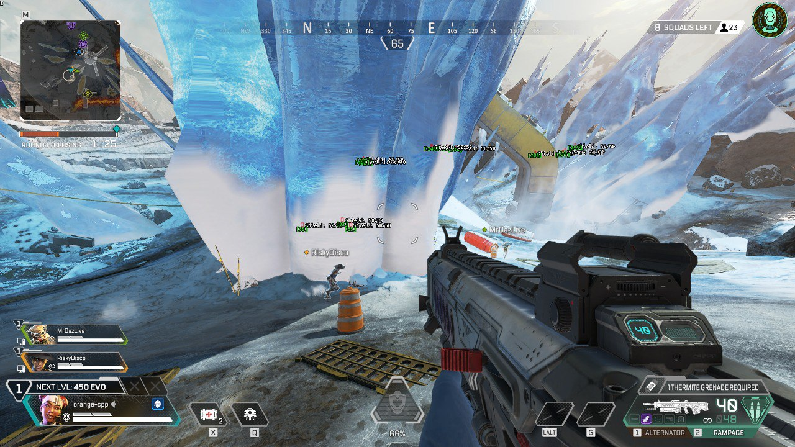
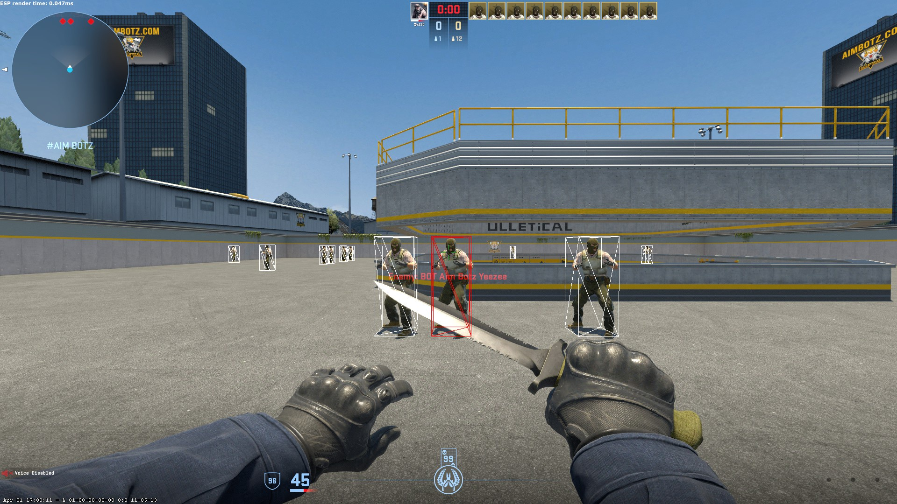

<div align = center>


[](https://www.codefactor.io/repository/github/orange-cpp/omath)

[](https://repology.org/project/orange-math/versions)

[](https://discord.gg/eDgdaWbqwZ)
[](https://t.me/orangennotes)

</div>

You're trying to build something. Something great. Something that matters. You have a smart team and they want to go fast. Fast means beating your competitors to market. 
Fast means attracting the best talent to your team. Today fast is no longer optional. It's essential to surviving and thriving.

But you also know that moving fast can break things. You could be just one bug away from everything coming to a standstill. What if you want to deliver quality and be fast?

That's where OMath comes in. OMath helps teams work better together through high code quality and game engine compatibility. This allows you to find problems quickly, so when you do break things, they break small, making for quick and easy fixes before your users see them.

And every member of your team can work independently because OMath is built to scale. No more waiting in line to get valuable updates out to your customers or developers fighting through reverse engineering to develop a basic feature or tweak a cheat setting. OMath eliminates the bottlenecks that slow down your delivery schedule and frustrate your team.

OMath helps your team focus on what matters: building great things and not waiting for great things to build. Find out more about how OMath can help your team work smarter and faster.

<div align = center>
 <a href="https://www.star-history.com/#orange-cpp/omath&Date">
  <picture>
    <source media="(prefers-color-scheme: dark)" srcset="https://api.star-history.com/svg?repos=orange-cpp/omath&type=Date&theme=dark" />
    <source media="(prefers-color-scheme: light)" srcset="https://api.star-history.com/svg?repos=orange-cpp/omath&type=Date" />
    
  </picture>
 </a>
</div>

## 👁‍🗨 Features
- **Efficiency**: Optimized for performance, ensuring quick computations using AVX2.
- **Versatility**: Includes a wide array of mathematical functions and algorithms.
- **Ease of Use**: Simplified interface for convenient integration into various projects.
- **Projectile Prediction**: Projectile prediction engine with O(N) algo complexity, that can power you projectile aim-bot.
- **3D Projection**: No need to find view-projection matrix anymore you can make your own projection pipeline.
- **Collision Detection**: Production ready code to handle collision detection by using simple interfaces.
- **No Additional Dependencies**: No additional dependencies need to use OMath except unit test execution
- **Ready for meta-programming**: Omath use templates for common types like Vectors, Matrixes etc, to handle all types!

## Supported Render Pipelines
| ENGINE   | SUPPORT |
|----------|---------|
| Source   | ✅YES    |
| Unity    | ✅YES    |
| IWEngine | ✅YES    |
| OpenGL   | ✅YES    |
| Unreal   | ✅YES    |

## Supported Operating Systems

| OS             | SUPPORT |
|----------------|---------|
| Windows 10/11  | ✅YES    |
| Linux          | ✅YES    |
| Darwin (MacOS) | ✅YES    |

## ⏬ Installation
Please read our [installation guide](https://github.com/orange-cpp/omath/blob/main/INSTALL.md). If this link doesn't work check out INSTALL.md file.

## ❔ Usage
ESP example
```c++
omath::source_engine::Camera cam{localPlayer.GetCameraOrigin(),
                                 localPlayer.GetAimPunch(),
                                 {1920.f, 1080.f},
                                 localPlayer.GetFieldOfView(),
                                 0.01.f, 30000.f};

for (auto ent: apex_sdk::EntityList::GetAllEntities())
{
    const auto bottom = cam.world_to_screen(ent.GetOrigin());
    const auto top = cam.world_to_screen(ent.GetBonePosition(8) + omath::Vector3<float>{0, 0, 10});

    const auto ent_health = ent.GetHealth();

    if (!top || !bottom || ent_health <= 0)
        continue;
    // esp rendering...
}
```
## Showcase
<details>
  <summary>OMATH for making cheats (click to open)</summary>

With `omath/projection` module you can achieve simple ESP hack for powered by Source/Unreal/Unity engine games, like [Apex Legends](https://store.steampowered.com/app/1172470/Apex_Legends/).


Or for InfinityWard Engine based games. Like Call of Duty Black Ops 2!

Or create simple trigger bot with embeded traceline from omath::collision::LineTrace

Or even advanced projectile aimbot
[Watch Video](https://youtu.be/lM_NJ1yCunw?si=5E87OrQMeypxSJ3E)
</details>

## 🫵🏻 Contributing
Contributions to `omath` are welcome! Please read `CONTRIBUTING.md` for details on our code of conduct and the process for submitting pull requests.

## 📜 License
This project is licensed under the ZLIB - see the `LICENSE` file for details.

## 💘 Acknowledgments
-  [All contributors](https://github.com/orange-cpp/omath/graphs/contributors)
