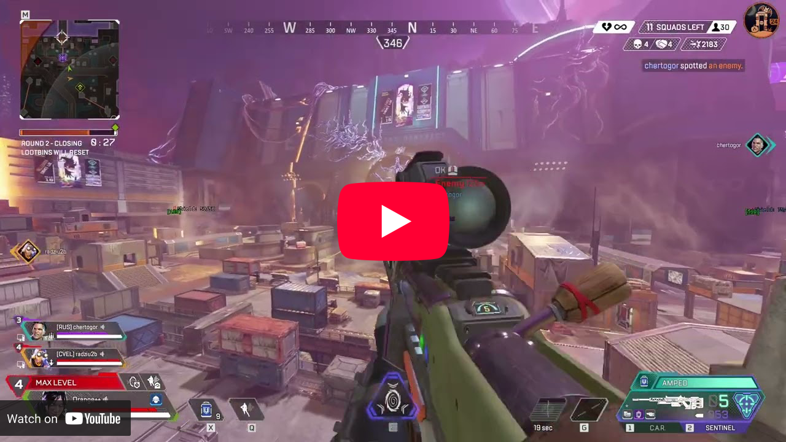

<div class="center-text">
<!-- Banner -->
<p>
  
</p>

<!-- Badges -->
<p>
  
  
  
  <a href="https://www.codefactor.io/repository/github/orange-cpp/omath">
    
  </a>
  
  <a href="https://repology.org/project/orange-math/versions">
    
  </a>
  
  <a href="https://discord.gg/eDgdaWbqwZ">
    
  </a>
  <a href="https://t.me/orangennotes">
    
  </a>
</p>
</div>

OMath is a 100% independent, constexpr template blazingly fast math library that doesn't have legacy C++ code.

It provides the latest features, is highly customizable, has all for cheat development, DirectX/OpenGL/Vulkan support, premade support for different game engines, much more constexpr stuff than in other libraries and more...

---

## 🚀 Quick Start

**New to OMath?** Start here:

- **[Getting Started Guide](getting_started.md)** - Installation and first steps
- **[API Overview](api_overview.md)** - High-level API reference
- **[Installation Instructions](install.md)** - Detailed setup guide

**Quick example:**

```cpp
#include <omath/omath.hpp>

using namespace omath;

Vector3<float> a{1, 2, 3};
Vector3<float> b{4, 5, 6};

auto dot = a.dot(b);              // 32.0
auto cross = a.cross(b);          // (-3, 6, -3)
auto distance = a.distance_to(b); // ~5.196
```

---

## 📚 Documentation Structure

### Core Mathematics

**Linear Algebra**
- [Vector2](linear_algebra/vector2.md) - 2D vectors with full operator support
- [Vector3](linear_algebra/vector3.md) - 3D vectors, dot/cross products, angles
- [Vector4](linear_algebra/vector4.md) - 4D vectors (homogeneous coordinates)
- [Mat4X4](linear_algebra/mat.md) - 4×4 matrices for transformations
- [Triangle](linear_algebra/triangle.md) - Triangle primitive and utilities

**Trigonometry**
- [Angle](trigonometry/angle.md) - Strong-typed angle system with range enforcement
- [Angles](trigonometry/angles.md) - Angle utilities and conversions
- [View Angles](trigonometry/view_angles.md) - Pitch/Yaw/Roll for camera systems

**3D Primitives**
- [Box](3d_primitives/box.md) - Axis-aligned bounding boxes
- [Plane](3d_primitives/plane.md) - Infinite planes and intersections

### Game Development Features

**Projection & Camera**
- [Camera](projection/camera.md) - Generic camera system with engine traits
- [Error Codes](projection/error_codes.md) - Projection error handling

**Collision Detection**
- [Line Tracer](collision/line_tracer.md) - Ray-triangle, ray-plane intersections

**Projectile Prediction**
- [Projectile Engine Interface](projectile_prediction/projectile_engine.md) - Base interface
- [Projectile](projectile_prediction/projectile.md) - Projectile properties
- [Target](projectile_prediction/target.md) - Target state representation
- [Legacy Engine](projectile_prediction/proj_pred_engine_legacy.md) - Standard implementation
- [AVX2 Engine](projectile_prediction/proj_pred_engine_avx2.md) - Optimized implementation

**Pathfinding**
- [A* Algorithm](pathfinding/a_star.md) - A* pathfinding implementation
- [Navigation Mesh](pathfinding/navigation_mesh.md) - Triangle-based navigation

### Game Engine Support

OMath provides built-in support for multiple game engines with proper coordinate system handling:

**Source Engine** (Valve - CS:GO, TF2, etc.)
- [Camera Trait](engines/source_engine/camera_trait.md)
- [Pred Engine Trait](engines/source_engine/pred_engine_trait.md)
- [Constants](engines/source_engine/constants.md)
- [Formulas](engines/source_engine/formulas.md)

**Unity Engine**
- [Camera Trait](engines/unity_engine/camera_trait.md)
- [Pred Engine Trait](engines/unity_engine/pred_engine_trait.md)
- [Constants](engines/unity_engine/constants.md)
- [Formulas](engines/unity_engine/formulas.md)

**Unreal Engine** (Epic Games)
- [Camera Trait](engines/unreal_engine/camera_trait.md)
- [Pred Engine Trait](engines/unreal_engine/pred_engine_trait.md)
- [Constants](engines/unreal_engine/constants.md)
- [Formulas](engines/unreal_engine/formulas.md)

**Frostbite Engine** (EA - Battlefield, etc.)
- [Camera Trait](engines/frostbite/camera_trait.md)
- [Pred Engine Trait](engines/frostbite/pred_engine_trait.md)
- [Constants](engines/frostbite/constants.md)
- [Formulas](engines/frostbite/formulas.md)

**IW Engine** (Infinity Ward - Call of Duty)
- [Camera Trait](engines/iw_engine/camera_trait.md)
- [Pred Engine Trait](engines/iw_engine/pred_engine_trait.md)
- [Constants](engines/iw_engine/constants.md)
- [Formulas](engines/iw_engine/formulas.md)

**OpenGL Engine** (Canonical OpenGL)
- [Camera Trait](engines/opengl_engine/camera_trait.md)
- [Pred Engine Trait](engines/opengl_engine/pred_engine_trait.md)
- [Constants](engines/opengl_engine/constants.md)
- [Formulas](engines/opengl_engine/formulas.md)

### Utilities

**Color**
- [Color](utility/color.md) - RGBA color with conversions

**Pattern Scanning & Memory**
- [Pattern Scan](utility/pattern_scan.md) - Binary pattern search with wildcards
- [PE Pattern Scan](utility/pe_pattern_scan.md) - PE file pattern scanning

**Reverse Engineering**
- [External Rev Object](rev_eng/external_rev_object.md) - External process memory access
- [Internal Rev Object](rev_eng/internal_rev_object.md) - Internal memory access

---

## ✨ Key Features

- **Efficiency**: Optimized for performance, ensuring quick computations using AVX2.
- **Versatility**: Includes a wide array of mathematical functions and algorithms.
- **Ease of Use**: Simplified interface for convenient integration into various projects.
- **Projectile Prediction**: Projectile prediction engine with O(N) algo complexity, that can power you projectile aim-bot.
- **3D Projection**: No need to find view-projection matrix anymore you can make your own projection pipeline.
- **Collision Detection**: Production ready code to handle collision detection by using simple interfaces.
- **No Additional Dependencies**: No additional dependencies need to use OMath except unit test execution
- **Ready for meta-programming**: Omath use templates for common types like Vectors, Matrixes etc, to handle all types!
- **Engine support**: Supports coordinate systems of **Source, Unity, Unreal, Frostbite, IWEngine and canonical OpenGL**.
- **Cross platform**: Supports Windows, MacOS and Linux.
- **Algorithms**: Has ability to scan for byte pattern with wildcards in PE files/modules, binary slices, works even with Wine apps.

---

## 📖 Common Use Cases

### World-to-Screen Projection
Project 3D world coordinates to 2D screen space for ESP overlays, UI elements, or visualization.

### Projectile Prediction
Calculate aim points for moving targets considering projectile speed, gravity, and target velocity.

### Collision Detection
Perform ray-casting, line tracing, and intersection tests for hit detection and physics.

### Pattern Scanning
Search for byte patterns in memory for reverse engineering, modding, or tool development.

### Pathfinding
Find optimal paths through 3D spaces using A* algorithm and navigation meshes.

---

## 🎮 Gallery

<br>

[](https://youtu.be/lM_NJ1yCunw?si=-Qf5yzDcWbaxAXGQ)

<br>

![APEX Preview]

<br>

![BO2 Preview]

<br>

![CS2 Preview]

<br>

![TF2 Preview]

<br>
<br>

---

## 🤝 Community & Support

- **Documentation**: [http://libomath.org](http://libomath.org)
- **GitHub**: [orange-cpp/omath](https://github.com/orange-cpp/omath)
- **Discord**: [Join our community](https://discord.gg/eDgdaWbqwZ)
- **Telegram**: [@orangennotes](https://t.me/orangennotes)
- **Issues**: [Report bugs or request features](https://github.com/orange-cpp/omath/issues)

---

## 💡 Contributing

OMath is open source and welcomes contributions! See [CONTRIBUTING.md](https://github.com/orange-cpp/omath/blob/master/CONTRIBUTING.md) for guidelines.

---

*Last updated: 1 Nov 2025*

<!----------------------------------{ Images }--------------------------------->
[APEX Preview]: images/showcase/apex.png
[BO2 Preview]: images/showcase/cod_bo2.png
[CS2 Preview]: images/showcase/cs2.jpeg
[TF2 Preview]: images/showcase/tf2.jpg